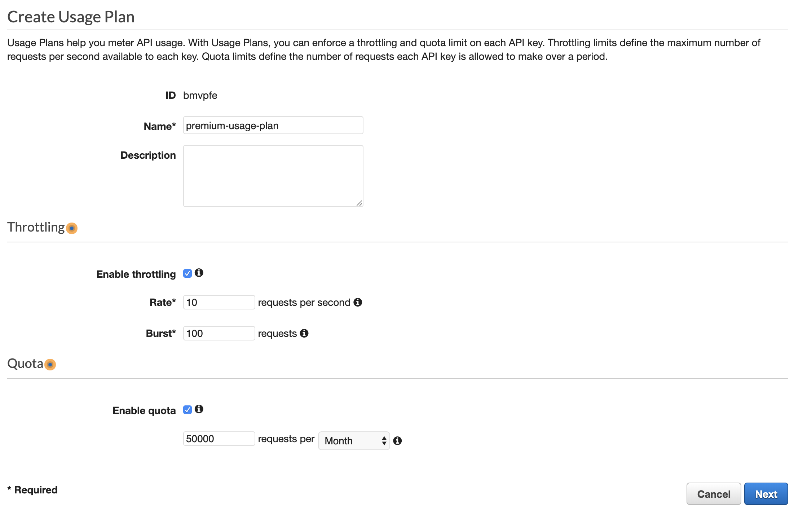
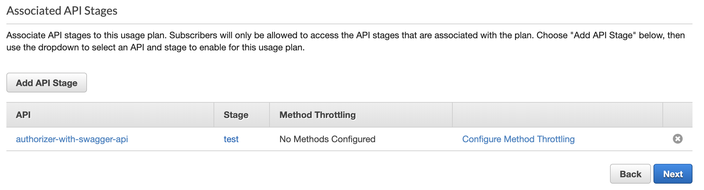
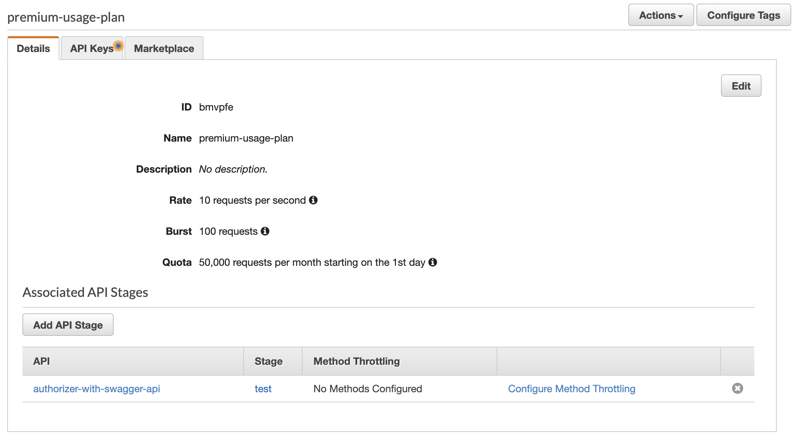
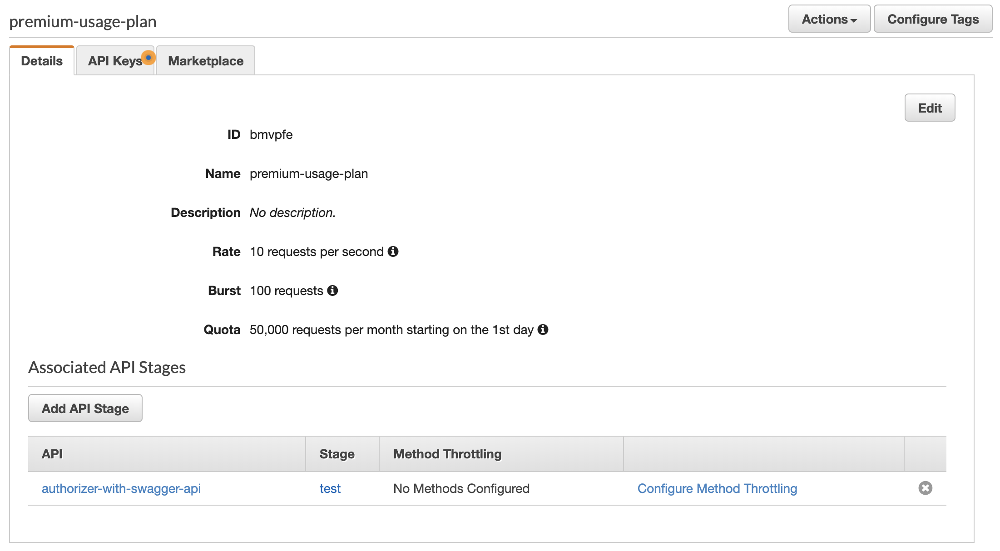
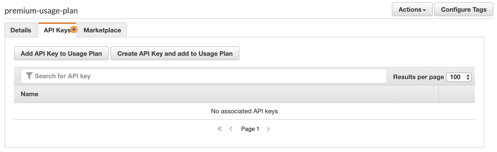
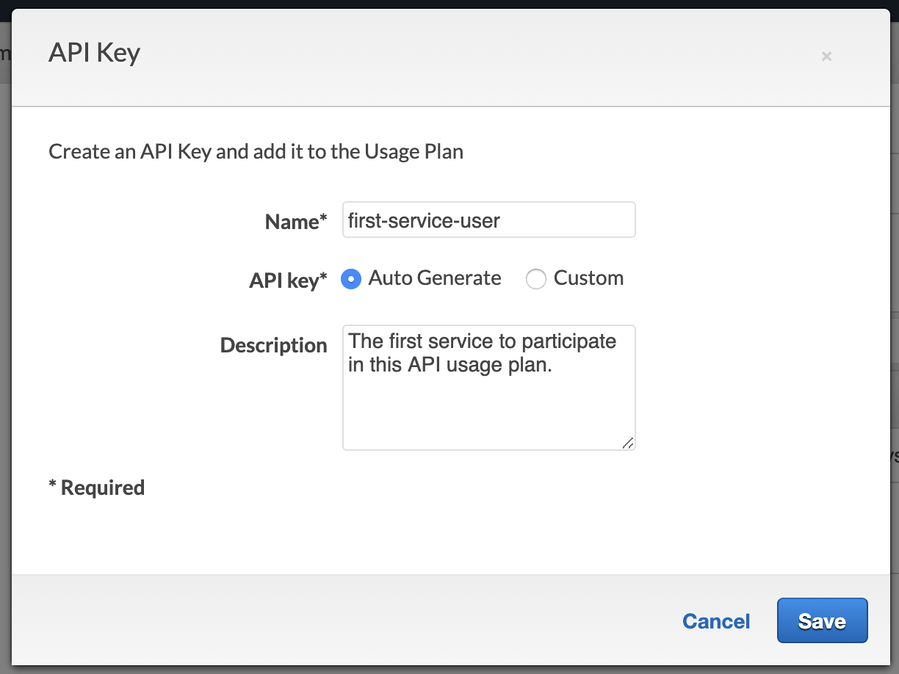
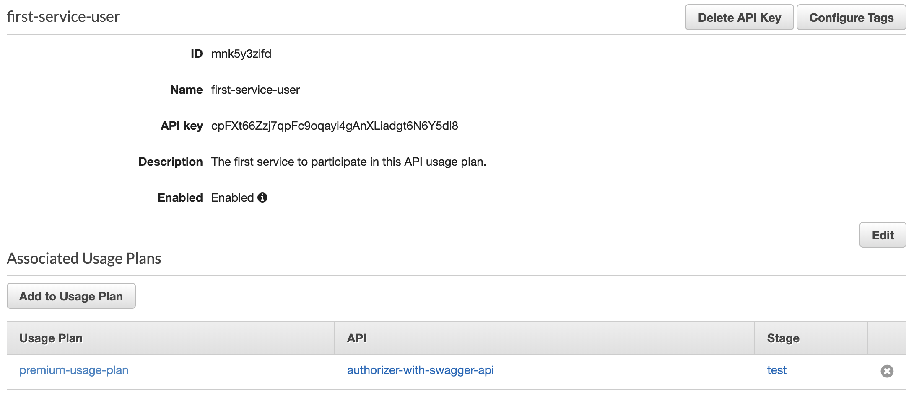
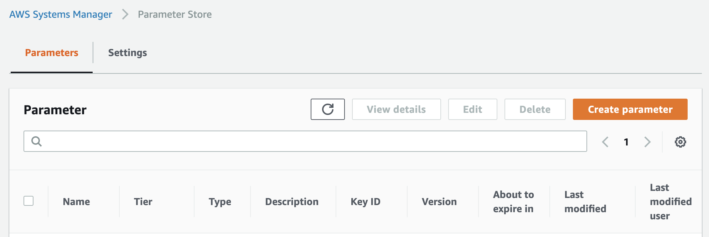
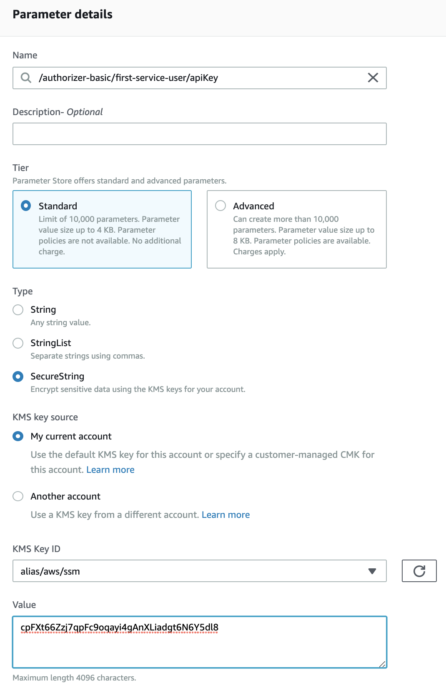

# authorizer-basic

- [authorizer-basic](#authorizer-basic)
  - [Usage](#usage)
    - [With Swagger](#with-swagger)
    - [Without Swagger](#without-swagger)
  - [Managing API Consumers](#managing-api-consumers)
    - [Creating a Usage Plan](#creating-a-usage-plan)
    - [Adding an API consumer](#adding-an-api-consumer)
  - [Support](#support)

## Usage

Make sure you have `terraform` installed with a version greater than `0.12`.

It also helps to set the following environment variables before running any `terraform` commands.

```sh
export AWS_PROFILE=<some-profile>
export AWS_REGION=<some-region>
```

For example:

```sh
export AWS_PROFILE=personal-aws-account
export AWS_REGION=us-east-1
```

To use this module directly, import it into your `terraform` document with the following configuration.

```terraform
module "authorizer" {
  source = "github.com/khalidx/auth.git//basic/terraform?ref=master"
  
  ...module configuration options go here...
}
```

This module allows you to configure your AWS API Gateway with a Swagger/OpenAPI specification document. If you *aren't* using Swagger, the module will still correctly configure your API.

To see an example of this module fully imported and configured, browse either:

- the `./examples/authorizer-with-swagger/` directory
- the `./examples/authorizer-without-swagger/` directory

Both examples deploy a sample API to the AWS API Gateway that is properly configured to use the authorizer.

For the Swagger example, pay special attention to any `x-amazon-apigateway-` configurations in the `swagger.yaml` file as well as the comments in the well-documented `main.tf` file. Reading both documents in the example will help you understand how all the components fit and work together.

To deploy an example, browse into the directory for the example and run the following commands.

```sh
terraform init
terraform apply
```

### With Swagger

If you *are* using Swagger:

1. import the module:

```terraform
module "authorizer" {
  source = "github.com/khalidx/auth.git//basic/terraform?ref=master"
}
```

2. configure your API Gateway using your Swagger file; for example:

```terraform
resource "aws_api_gateway_rest_api" "api" {
  ...

  body                     = "${templatefile("${path.module}/swagger.yaml", {
    authorizer-uri         = "${module.authorizer.authorizer-uri}"
    authorizer-credentials = "${module.authorizer.authorizer-credentials}"
  })}"
}
```

3. ensure any operations to be protected reference the `security` definition; for example:

```json
...

"paths": {
  "/hello": {
      "get": {
        "security": [ { "basicAuth" : [] } ]
```

Alternatively, in YAML:

```yaml
...

paths:
  /hello:
    get:
      security:
        - basicAuth: []
```

> This is a known limitation of AWS API Gateway, where security cannot be applied to the whole API, and must 
> be applied on a per-operation basis (sad).
> Read more about API Gateway limitations here:
> https://docs.aws.amazon.com/apigateway/latest/developerguide/api-gateway-known-issues.html
   
4. ensure that your Swagger specification includes the following statements at the top-level in the document:

```json
{
  "x-amazon-apigateway-api-key-source": "AUTHORIZER",
  "securityDefinitions": {
    "basicAuth": {
      "type": "apiKey",
      "name": "Authorization",
      "in": "header",
      "x-amazon-apigateway-authtype": "custom",
      "x-amazon-apigateway-authorizer": {
        "type": "token",
        "authorizerUri": "${authorizer-uri}",
        "authorizerCredentials": "${authorizer-credentials}",
        "identityValidationExpression": "^x-[a-z]+",
        "authorizerResultTtlInSeconds": 300
      }
    }
  },
  "responses": {
    "UnauthorizedError": {
      "description": "Authentication information is missing or invalid",
      "headers": {
        "WWW_Authenticate": {
          "type": "string"
        }
      }
    }
  },
  "x-amazon-apigateway-gateway-responses": {
    "UNAUTHORIZED": {
      "statusCode": "401",
      "responseParameters": {
        "gatewayresponse.header.WWW-Authenticate": "'Basic'"
      },
      "responseTemplates": {
        "application/json": "{\"message\": \"$context.error.messageString\" }"
      }
    }
  }
}
```

Alternatively, the statements above, in YAML:

```yaml
x-amazon-apigateway-api-key-source: "AUTHORIZER"
securityDefinitions:
  basicAuth:
    type: apiKey
    name: Authorization
    in: header
    x-amazon-apigateway-authtype: "custom"
    x-amazon-apigateway-authorizer:
      type: token
      authorizerUri: "${authorizer-uri}"
      authorizerCredentials: "${authorizer-credentials}"
      identityValidationExpression: "^x-[a-z]+"
      authorizerResultTtlInSeconds: 300
responses:
  UnauthorizedError:
    description: Authentication information is missing or invalid
    headers:
      WWW_Authenticate:
        type: string
x-amazon-apigateway-gateway-responses:
  UNAUTHORIZED:
    statusCode: '401'
    responseParameters:
      gatewayresponse.header.WWW-Authenticate: "'Basic'"
    responseTemplates:
      application/json: '{"message": "$context.error.messageString" }'
```

### Without Swagger

If you *aren't* using Swagger:

1. import the module, and set the `api-id` in the module configuration to the ID of your AWS API Gateway Rest API; for example:

```terraform
module "authorizer" {
  source  = "git::git@github.com:khalidx/auth.git//basic/terraform?ref=v1.0.0"
  api-id = "${aws_api_gateway_rest_api.api.id}"
}
```

2. ensure that your `aws_api_gateway_rest_api` resource has the `api_key_source` field; for example:

```terraform
resource "aws_api_gateway_rest_api" "api" {
  ...

  api_key_source = "${module.authorizer.api-key-source}"
}
```

3. ensure that any `aws_api_gateway_method` resources in your `terraform` configuration have the proper authorizer-related fields; for example:

```terraform
resource "aws_api_gateway_method" "example-method" {
  ...

  authorization    = "${module.authorizer.authorization}"
  authorizer_id    = "${module.authorizer.authorizer-id}"
  api_key_required = "${module.authorizer.api-key-required}"
}
```

## Managing API Consumers

After deploying this module, you'll want to configure some credentials for other users or services to start consuming your API.

### Creating a Usage Plan

1. [Browse to the AWS API Gateway Console > Usage Plans > Create Usage Plan](https://console.aws.amazon.com/apigateway/home#/usage-plans/create)



2. Associate a stage of your deployed API to the usage plan.



3. Click "Done". We'll add API keys in the next section.



### Adding an API consumer

1. [Browse to the AWS API Gateway Console > Usage Plans](https://console.aws.amazon.com/apigateway/home#/usage-plans) and select a usage plan that you have created.



2. Browse to the Usage Plan's `API Keys` and click `Create API Key and add to Usage Plan`.



3. Enter data into the fields and click save.



4. Click the newly created API Key, then click "Show" to display the API Key value. Copy the API Key, we'll use it in the next step.



5. [Browse to the AWS SSM Parameter Store Console](https://console.aws.amazon.com/systems-manager/parameters)



6. Click on `Create Parameter`. We'll be creating three `SecureString` parameters for the new API consumer:

- one for the api key
- one for the password
- one for whitelisted operations that the consumer can access

All parameters are namespaced by the application name that you've set in the module configuration, which defaults to `authorizer-basic`.

The format is `/<authorizer-name>/<user-name>/<key>`.

The keys we will be creating are:

- `/authorizer-basic/first-service-user/apiKey`
- `/authorizer-basic/first-service-user/password`
- `/authorizer-basic/first-service-user/whitelist`

You'll notice we are using the same name, *first-service-user*, that we used when creating the name of the new API Key. This doesn't do anything *functionally*, but allows us to easily visually associate api keys to usernames.

Here's what the console will look like when configuring the `apiKey` parameter.



Repeat this process for the `password` key, pasting a generated password in the `Value` field.

Also repeat this process for the `whitelist` key, pasting an array of allowed operations for the user to access. For example, the `Value` could be:

```json
[
  "GET/hello",
  "POST/goodbye/1"
]
```

This will provision the API consumer with the ability to only access that part of the API.

## Support

Open a GitHub issue to ask a question, report a bug, raise a concern, or request a new feature.
